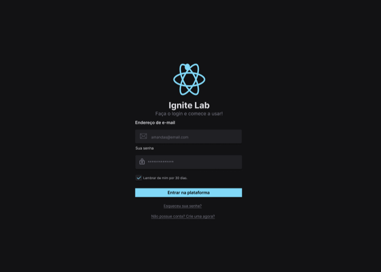

# Ignite - Lab

Projeto  desenvolvido durante o ignite Lab 03 - Figma ao React - Maratona da Rocketseat. 

Foi ultilizado pacotes como o tailwind css e o storybook.

Segue o layout feito no Figma:

https://www.figma.com/file/L6JmAu8r6G7cYkLfIdkOym/Login?node-id=0%3A1

<br>
</br>



## Como executar

### Projeto React

Baixe este repositório para no seu computador:

```
git clone https://github.com/AmandaSoaress/ignite-lab-design-system.git
```

Dentro de um terminal, instale as dependências:

```
npm install
```

Execute o projeto:

```
npm run dev
```

Caso não abra automaticamente, você pode acessar o link: http://127.0.0.1:5173/

### Storybook

Para executar o storybook, basta executar:

```
npm run storybook
```


Você pode conferir a documentação no link: http://localhost:6006/